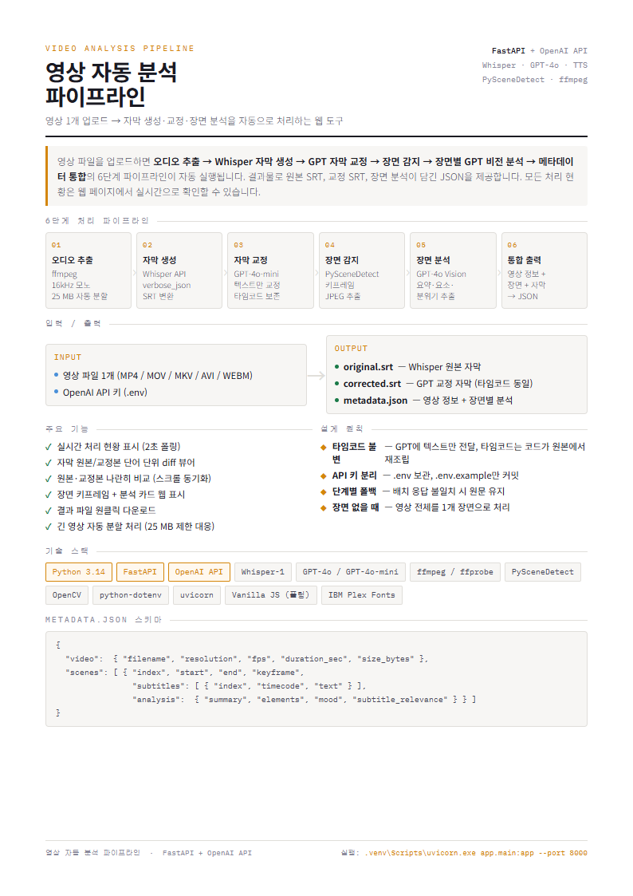
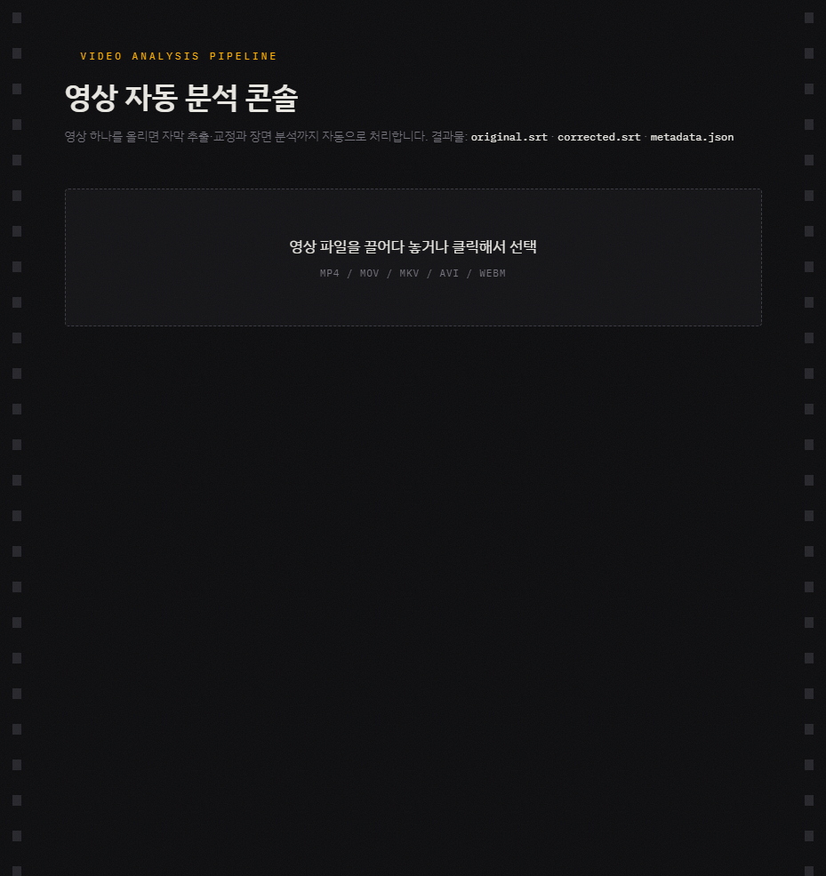
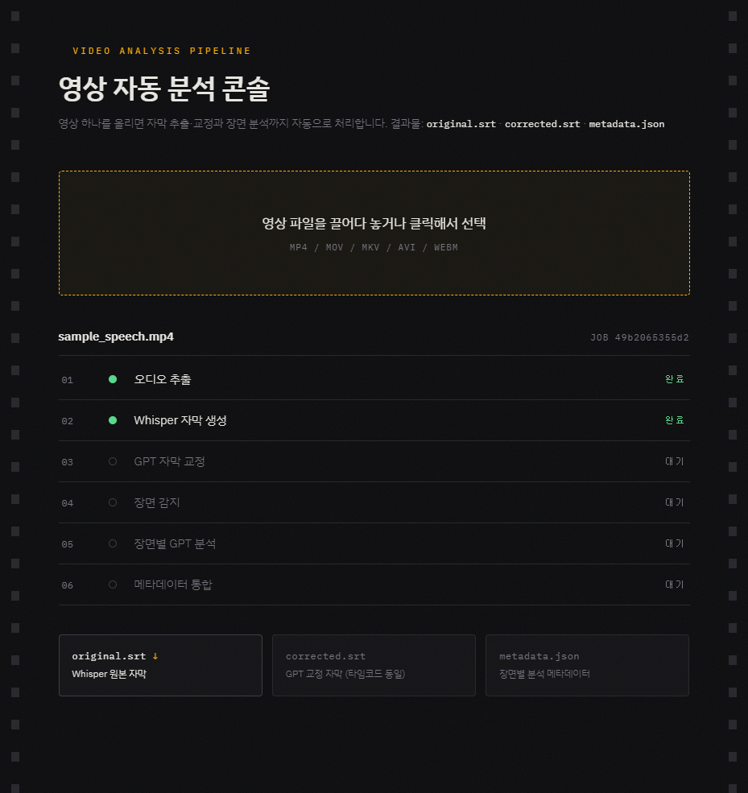

# 영상 자동 분석 파이프라인

영상 파일 하나를 업로드하면 오디오 추출 → 자막 생성 → 자막 교정 → 장면 감지 → 장면별 AI 분석 → 메타데이터 통합까지 자동으로 처리하는 웹 애플리케이션입니다.



## 주요 기능

- **자막 생성**: OpenAI Whisper API(cloud) 또는 faster-whisper(on-premise)로 SRT 자막 생성
- **자막 교정**: GPT를 이용한 오탈자·띄어쓰기·외래어 교정 (타임코드는 구조적으로 보호)
- **장면 감지**: PySceneDetect로 장면 경계를 자동 검출하고 키프레임 추출
- **장면 분석**: GPT-4o Vision으로 키프레임 이미지 + 자막을 분석해 요약·분위기·등장 요소 추출
- **메타데이터 통합**: 전체 결과를 `metadata.json` 하나로 묶어 다운로드 제공
- **QC 리포트**: 교정 전후 타임코드 무결성 검증 자동 수행
- **프롬프트 커스터마이징**: 웹 UI에서 Whisper 힌트·교정 규칙·분석 지시문 실시간 편집

## 동작 모드

| 모드 | 음성 인식 | 자막 교정 | 장면 분석 |
|---|---|---|---|
| `cloud` | OpenAI Whisper API | GPT | GPT-4o Vision |
| `on-premise` | faster-whisper (로컬) | NLLB 번역 | 건너뜀 |

## 출력 파일

| 파일 | 설명 |
|---|---|
| `original.srt` | Whisper 원본 자막 |
| `corrected.srt` | GPT 교정 자막 |
| `metadata.json` | 장면별 분석 결과 통합 JSON |
| `qc_report.json` | 타임코드 무결성 검증 리포트 |

## 스크린샷

| 업로드 | 진행 중 | 결과 |
|---|---|---|
|  |  |  |

## 요구 사항

- Python 3.10+
- [ffmpeg](https://ffmpeg.org/) (PATH에 등록 필요)
- OpenAI API 키 (cloud 모드)
- CUDA GPU (on-premise 모드 권장)

## 빠른 시작

```bash
# 1. 의존성 설치
pip install -r requirements.txt

# 2. API 키 설정
cp .env.example .env
# .env 파일에 OPENAI_API_KEY=sk-... 입력

# 3. 서버 실행
uvicorn app.main:app --reload

# 4. 브라우저 열기
# http://localhost:8000
```

## 프로젝트 구조

```
.
├── app/
│   ├── main.py           # FastAPI 엔드포인트
│   ├── pipeline.py       # 파이프라인 오케스트레이션
│   ├── prompts.py        # 프롬프트 관리
│   ├── device.py         # GPU/CPU 감지
│   ├── srt_utils.py      # SRT 파싱 유틸리티
│   ├── ffmpeg.py         # ffmpeg 래퍼
│   ├── steps/
│   │   ├── audio.py      # ① 오디오 추출
│   │   ├── transcribe.py # ② Whisper API 자막
│   │   ├── transcribe_local.py  # ② faster-whisper 자막
│   │   ├── correct.py    # ③ GPT 자막 교정
│   │   ├── translate.py  # ③ NLLB 번역 (on-premise)
│   │   ├── scenes.py     # ④ 장면 감지 + 키프레임
│   │   ├── analyze.py    # ⑤ GPT-4o Vision 분석
│   │   ├── merge.py      # ⑥ metadata.json 통합
│   │   └── qc.py         # ⑦ 타임코드 QC
│   └── static/index.html # 웹 UI
├── jobs/                 # 작업별 중간 산출물 (자동 생성)
├── .env.example
└── requirements.txt
```

## API 엔드포인트

| 메서드 | 경로 | 설명 |
|---|---|---|
| `POST` | `/api/upload` | 영상 파일 업로드 및 파이프라인 시작 |
| `GET` | `/api/jobs/{job_id}` | 작업 상태 조회 |
| `GET` | `/api/jobs/{job_id}/subtitles` | 원본/교정 자막 비교 조회 |
| `GET` | `/api/jobs/{job_id}/keyframes/{name}` | 키프레임 이미지 조회 |
| `GET` | `/api/jobs/{job_id}/files/{name}` | 결과 파일 다운로드 |
| `GET` | `/api/prompts` | 현재 프롬프트 조회 |
| `PUT` | `/api/prompts` | 프롬프트 수정 |
| `POST` | `/api/prompts/reset` | 프롬프트 기본값 복원 |

## 지원 입력 형식

`.mp4` · `.mov` · `.mkv` · `.avi` · `.webm`

## 라이선스

MIT
