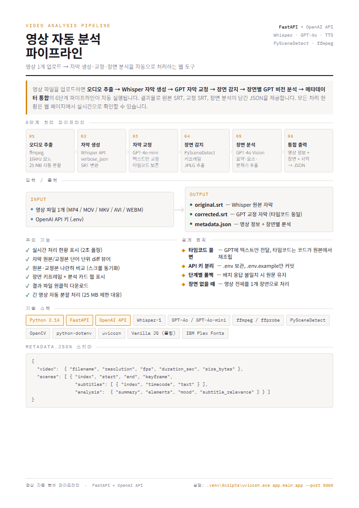
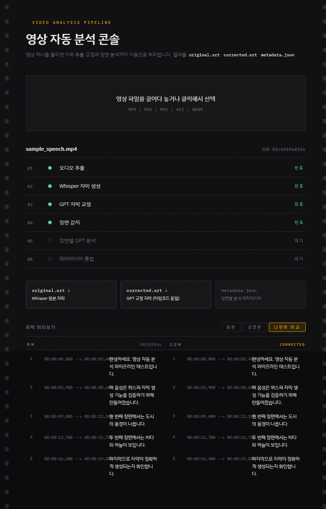
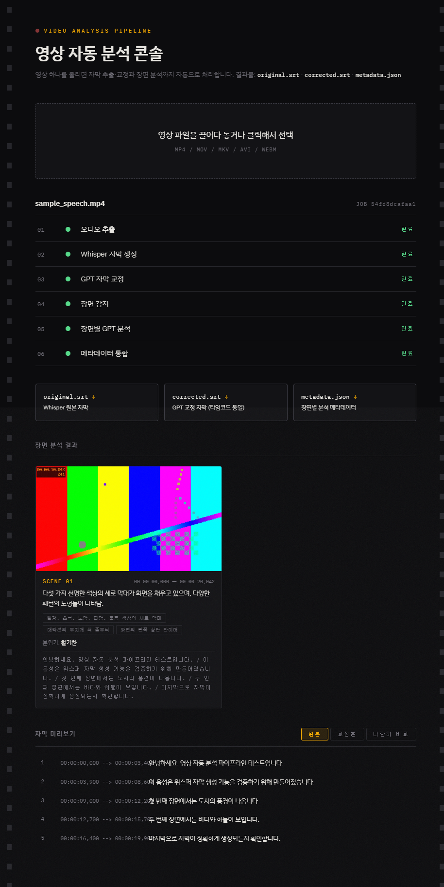
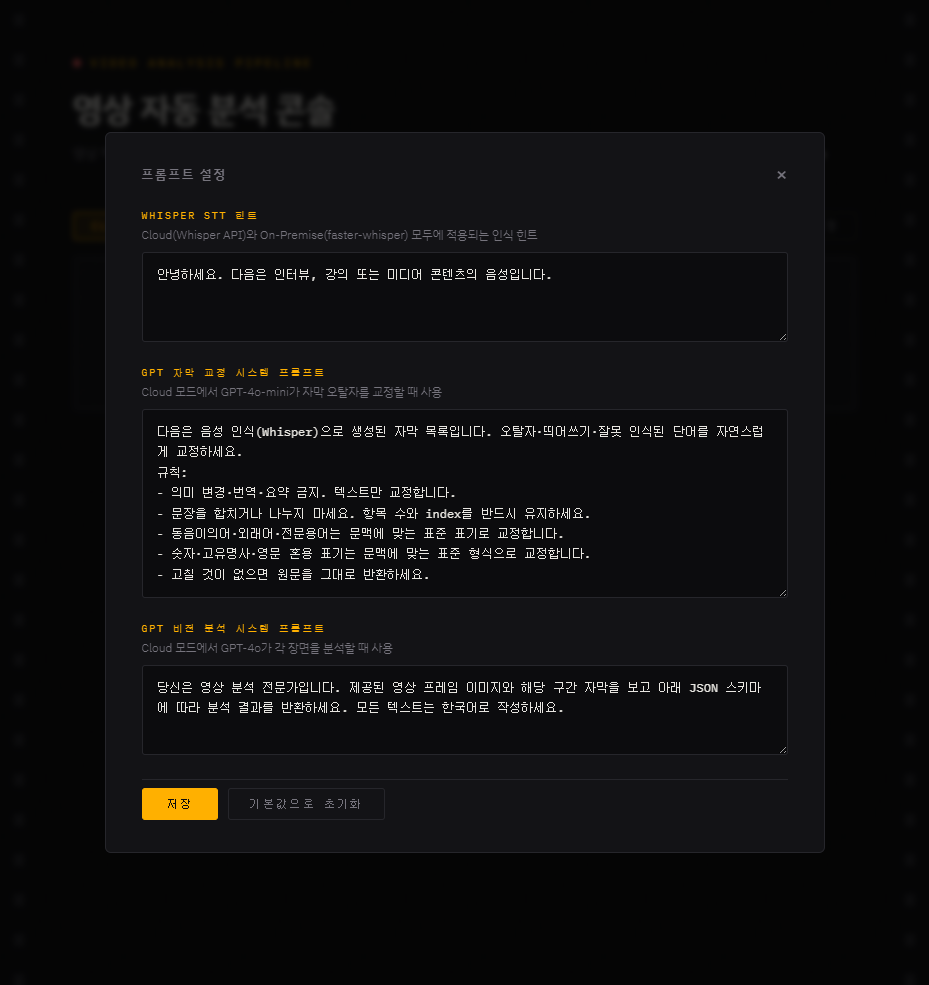

# 영상 자동 분석 파이프라인


영상 파일 하나를 업로드하면 **오디오 추출 → 자막 생성 → 자막 교정 → 장면 감지 → AI 장면 분석 → 메타데이터 통합**까지 6단계를 자동으로 처리하는 웹 애플리케이션입니다.



---

## 목차

- [주요 기능](#주요-기능)
- [동작 모드](#동작-모드)
- [스크린샷](#스크린샷)
- [요구 사항](#요구-사항)
- [설치 및 실행](#설치-및-실행)
- [파이프라인 단계](#파이프라인-단계)
- [출력 파일](#출력-파일)
- [API 엔드포인트](#api-엔드포인트)
- [프로젝트 구조](#프로젝트-구조)

---

## 주요 기능

- **자막 생성** — OpenAI Whisper API(cloud) 또는 faster-whisper(on-premise)로 SRT 자막 자동 생성. 25MB 초과 영상은 자동 분할 처리
- **자막 교정** — GPT-4o-mini로 오탈자·띄어쓰기·외래어 교정. 타임코드는 GPT에 전달하지 않고 코드가 원본에서 재조립해 수정 불가능하도록 구조적으로 보호
- **장면 감지** — PySceneDetect로 장면 경계를 자동 검출하고 각 장면의 중간 프레임을 키프레임으로 추출
- **장면 분석** — GPT-4o Vision으로 키프레임 이미지 + 해당 구간 자막을 함께 분석해 요약·분위기·등장 요소 추출
- **자막 비교 뷰어** — 원본/교정본을 단어 단위로 diff 강조하여 나란히 표시
- **메타데이터 통합** — 모든 분석 결과를 `metadata.json` 하나로 통합 제공
- **QC 리포트** — 교정 전후 타임코드 무결성 자동 검증
- **프롬프트 커스터마이징** — 웹 UI에서 Whisper 힌트·교정 규칙·분석 지시문 실시간 편집 및 저장

---

## 동작 모드

| 모드 | 음성 인식 | 자막 교정 | 장면 분석 | 인터넷 필요 |
|:---:|:---:|:---:|:---:|:---:|
| `cloud` | OpenAI Whisper API | GPT-4o-mini | GPT-4o Vision | O |
| `on-premise` | faster-whisper (로컬) | NLLB 번역 | 건너뜀 | X |

---

## 스크린샷

**업로드 화면**


**처리 진행 중**


**자막 비교 & 결과 다운로드**



**장면 분석 결과**



**프롬프트 설정**



---

## 요구 사항

- Python 3.10+
- [ffmpeg](https://ffmpeg.org/) — PATH에 등록 필요
- OpenAI API 키 — cloud 모드 사용 시
- CUDA GPU — on-premise 모드 권장 (CPU도 동작하나 느림)

---

## 설치 및 실행

```bash
# 1. 저장소 클론
git clone https://github.com/leelee0123/260610_test-prj1.git
cd 260610_test-prj1

# 2. 가상 환경 생성 (선택)
python -m venv .venv
.venv\Scripts\activate   # Windows
# source .venv/bin/activate  # macOS/Linux

# 3. 의존성 설치
pip install -r requirements.txt

# 4. API 키 설정
copy .env.example .env
# .env 파일을 열어 OPENAI_API_KEY=sk-... 입력

# 5. 서버 실행
uvicorn app.main:app --reload

# 6. 브라우저에서 접속
# http://localhost:8000
```

> on-premise 모드는 `faster-whisper`, `torch`, `transformers` 설치가 필요합니다. GPU가 없는 환경에서는 cloud 모드를 권장합니다.

---

## 파이프라인 단계

```
① 오디오 추출    ffmpeg로 16kHz 모노 MP3 추출 (25MB 초과 시 자동 분할)
② 자막 생성      Whisper API / faster-whisper → original.srt
③ 자막 교정      GPT-4o-mini 텍스트 교정 → corrected.srt (타임코드 불변)
④ 장면 감지      PySceneDetect ContentDetector → 장면 경계 + 키프레임 JPEG
⑤ 장면 분석      GPT-4o Vision (키프레임 + 자막) → 요약·요소·분위기 JSON
⑥ 메타데이터 통합 영상 정보 + 장면 분석 결과 → metadata.json
⑦ QC             원본/교정본 타임코드 diff 검증 → qc_report.json
```

---

## 출력 파일

| 파일 | 설명 |
|---|---|
| `original.srt` | Whisper 원본 자막 |
| `corrected.srt` | GPT 교정 자막 (타임코드 동일) |
| `metadata.json` | 장면별 분석 결과 통합 JSON |
| `qc_report.json` | 타임코드 무결성 검증 리포트 |

**metadata.json 스키마**

```json
{
  "video": { "filename": "...", "duration_sec": 0, "resolution": "1920x1080" },
  "scenes": [
    {
      "index": 1,
      "start": "00:00:00,000",
      "end": "00:00:12,340",
      "keyframe": "scene_001.jpg",
      "subtitles": [ { "index": 1, "start": "...", "end": "...", "text": "..." } ],
      "analysis": { "summary": "...", "elements": ["..."], "mood": "..." }
    }
  ]
}
```

---

## API 엔드포인트

| 메서드 | 경로 | 설명 |
|:---:|---|---|
| `POST` | `/api/upload` | 영상 파일 업로드 및 파이프라인 시작 |
| `GET` | `/api/jobs/{job_id}` | 작업 상태 조회 |
| `GET` | `/api/jobs/{job_id}/subtitles` | 원본/교정 자막 비교 조회 |
| `GET` | `/api/jobs/{job_id}/keyframes/{name}` | 키프레임 이미지 조회 |
| `GET` | `/api/jobs/{job_id}/files/{name}` | 결과 파일 다운로드 |
| `GET` | `/api/prompts` | 현재 프롬프트 조회 |
| `PUT` | `/api/prompts` | 프롬프트 수정 |
| `POST` | `/api/prompts/reset` | 프롬프트 기본값 복원 |

지원 입력 형식: `.mp4` · `.mov` · `.mkv` · `.avi` · `.webm`

---

## 프로젝트 구조

```
.
├── app/
│   ├── main.py                  # FastAPI 엔드포인트
│   ├── pipeline.py              # 파이프라인 오케스트레이션
│   ├── prompts.py               # 프롬프트 관리
│   ├── device.py                # GPU/CPU 감지
│   ├── srt_utils.py             # SRT 파싱 유틸리티
│   ├── ffmpeg.py                # ffmpeg 래퍼
│   ├── steps/
│   │   ├── audio.py             # ① 오디오 추출
│   │   ├── transcribe.py        # ② Whisper API 자막
│   │   ├── transcribe_local.py  # ② faster-whisper 자막 (on-premise)
│   │   ├── correct.py           # ③ GPT 자막 교정
│   │   ├── translate.py         # ③ NLLB 번역 (on-premise)
│   │   ├── scenes.py            # ④ 장면 감지 + 키프레임
│   │   ├── analyze.py           # ⑤ GPT-4o Vision 분석
│   │   ├── merge.py             # ⑥ metadata.json 통합
│   │   └── qc.py                # ⑦ 타임코드 QC
│   └── static/index.html        # 웹 UI
├── jobs/                        # 작업별 산출물 (자동 생성, gitignore)
├── samples/                     # 테스트용 샘플 영상
├── .env.example                 # API 키 템플릿
├── requirements.txt
└── README.md
```

---

## 라이선스

MIT
